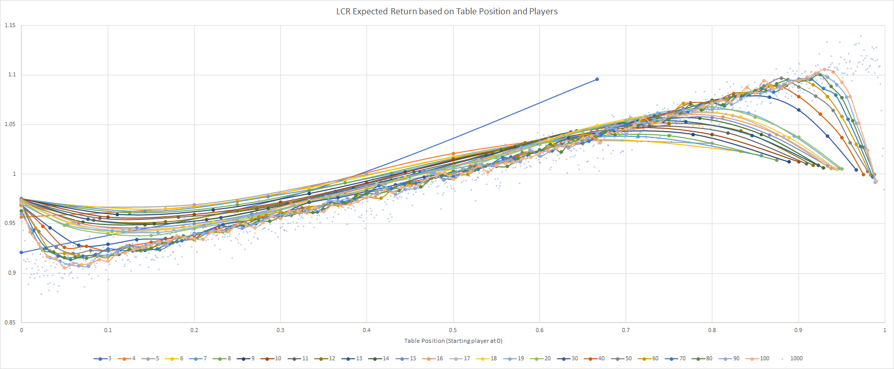

# lcr
[Left Center Right dice game](https://a.co/d/a84Hh7m) is biased unless starting player is randomized. A simulation quantifies it.

The [official rules](https://sites.temple.edu/alyssamartins/files/2016/12/Left-Center-Right1.pdf) are vague on who starts.

